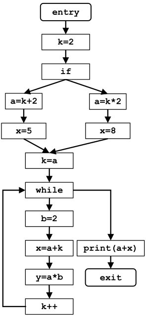

| &nbsp;                  | Constant Propagation                                                                                    |
| ----------------------- | ------------------------------------------------------------------------------------------------------- |
| Domain                  | set of pairs $\left(\text{variable}, \text{ constant value}\right)$                                     |
| Direction               | Forward: $\text{in}[b] = \land \text{ out}[\text{pred}(b)]$ $\text{out}[b] = f_b(\text{in}[b])$ |
| Transfer function       | $f_b(x) = \text{Gen}_b \cup \left(x - \text{Kill}_b\right)$                                             |
| Meet operator ($\land$) | $\cap$                                                                                                  |
| Boundary condition      | $\text{out}[\text{entry}] = \emptyset$                                                                  |
| Initial interior points | $\text{out}[b] = \mathcal{U}$                                                                           |

# Esercizio

## Iterazione 1

| &nbsp;                | Genb                             | Killb    | in[b]                                                                                                                 | out[b]                                                                                                                   |
| --------------------- | ------------------------------------------- | ------------------- | --------------------------------------------------------------------------------------------------------------------- | ------------------------------------------------------------------------------------------------------------------------ |
| entry                 | $\emptyset$                                 | $\emptyset$         | $\emptyset$                                                                                                           | $\emptyset$                                                                                                              |
| BB1 - `k = 2`         | $\left(k, 2\right)$                         | $\emptyset$         | out[entry]                                                                                                            | $\left\lbrace\left(k, 2\right)\right\rbrace$                                                                             |
| BB2 - `if`            | $\emptyset$                                 | $\emptyset$         | out[BB1]                                                                                                              | $\left\lbrace\left(k, 2\right)\right\rbrace$                                                                             |
| BB3 - `a = k + 2`     | $\left(a, k + 2 = 4\right)$                 | $\emptyset$         | out[BB2]                                                                                                              | $\left\lbrace\left(a, 4\right), \left(k, 2\right)\right\rbrace$                                                          |
| BB4 - `x = 5`         | $\left(x, 5\right)$                         | $\emptyset$         | out[BB3]                                                                                                              | $\left\lbrace\left(x, 5\right), \left(a, 4\right), \left(k, 2\right)\right\rbrace$                                       |
| BB5 - `a = k * 2`     | $\left(a, k\cdot 2 = 4\right)$              | $\emptyset$         | out[BB2]                                                                                                              | $\left\lbrace\left(a, 4\right), \left(k, 2\right)\right\rbrace$                                                          |
| BB6 - `x = 8`         | $\left(x, 8\right)$                         | $\emptyset$         | out[BB5]                                                                                                              | $\left\lbrace\left(x, 8\right), \left(a, 4\right), \left(k, 2\right)\right\rbrace$                                       |
| BB7 - `k = a`         | $\left(k, a = 4\right)$                     | $\left(k, 2\right)$ | $\text{out}[\text{BB4}] \cap \text{out}[\text{BB6}] = \left\lbrace\left(a, 4\right), \left(k, 2\right)\right\rbrace$  | $\left\lbrace\left(a, 4\right), \left(k, 4\right)\right\rbrace$                                                          |
| BB8 - `while`         | $\emptyset$                                 | $\emptyset$         | $\text{out}[\text{BB7}] \cap \text{out}[\text{BB12}] = \left\lbrace\left(a, 4\right), \left(k, 4\right)\right\rbrace$ | $\left\lbrace\left(a, 4\right), \left(k, 4\right)\right\rbrace$                                                          |
| BB9 - `b = 2`         | $\left(b, 2\right)$                         | $\emptyset$         | out[BB8]                                                                                                              | $\left\lbrace\left(b, 2\right), \left(a, 4\right), \left(k, 4\right)\right\rbrace$                                       |
| BB10 - `x = a + k`    | $\left(x, a + k = 4 + 4 = 8\right)$         | $\emptyset$         | out[BB9]                                                                                                              | $\left\lbrace\left(x, 8\right), \left(b, 2\right), \left(k, 4\right), \left(a, 4\right)\right\rbrace$                    |
| BB11 - `y = a * b`    | $\left(y, a \cdot b = 4 \cdot 2 = 8\right)$ | $\emptyset$         | out[BB10]                                                                                                             | $\left\lbrace\left(y, 8\right), \left(x, 8\right), \left(b, 2\right), \left(k, 4\right), \left(a, 4\right)\right\rbrace$ |
| BB12 - `k++`          | $\left(k, k + 1 = 5\right)$                 | $\left(k, 4\right)$ | out[BB11]                                                                                                             | $\left\lbrace\left(k, 5\right), \left(y, 8\right), \left(x, 8\right), \left(b, 2\right), \left(a, 4\right)\right\rbrace$ |
| BB13 - `print(a + x)` | $\emptyset$                                 | $\emptyset$         | out[BB8]                                                                                                              | $\left\lbrace\left(a, 4\right), \left(k, 4\right)\right\rbrace$                                                          |
| exit                  | $\emptyset$                                 | $\emptyset$         | out[BB13]                                                                                                             | $\left\lbrace\left(a, 4\right), \left(k, 4\right)\right\rbrace$                                                          |

Nel CFG c'è un loop, quindi eseguo un'altra iterazione.

## Iterazione 2

| &nbsp;                | Genb                | Killb    | in[b]                                                                                                                | out[b]                                                                             |
| --------------------- | ------------------------------ | ------------------- | -------------------------------------------------------------------------------------------------------------------- | ---------------------------------------------------------------------------------- |
| entry                 | $\emptyset$                    | $\emptyset$         | $\emptyset$                                                                                                          | $\emptyset$                                                                        |
| BB1 - `k = 2`         | $\left(k, 2\right)$            | $\emptyset$         | out[entry]                                                                                                           | $\left\lbrace\left(k, 2\right)\right\rbrace$                                       |
| BB2 - `if`            | $\emptyset$                    | $\emptyset$         | out[BB1]                                                                                                             | $\left\lbrace\left(k, 2\right)\right\rbrace$                                       |
| BB3 - `a = k + 2`     | $\left(a, k + 2 = 4\right)$    | $\emptyset$         | out[BB2]                                                                                                             | $\left\lbrace\left(a, 4\right), \left(k, 2\right)\right\rbrace$                    |
| BB4 - `x = 5`         | $\left(x, 5\right)$            | $\emptyset$         | out[BB3]                                                                                                             | $\left\lbrace\left(x, 5\right), \left(a, 4\right), \left(k, 2\right)\right\rbrace$ |
| BB5 - `a = k * 2`     | $\left(a, k\cdot 2 = 4\right)$ | $\emptyset$         | out[BB2]                                                                                                             | $\left\lbrace\left(a, 4\right), \left(k, 2\right)\right\rbrace$                    |
| BB6 - `x = 8`         | $\left(x, 8\right)$            | $\emptyset$         | out[BB5]                                                                                                             | $\left\lbrace\left(x, 8\right), \left(a, 4\right), \left(k, 2\right)\right\rbrace$ |
| BB7 - `k = a`         | $\left(k, a = 4\right)$        | $\left(k, 2\right)$ | $\text{out}[\text{BB4}] \cap \text{out}[\text{BB6}] = \left\lbrace\left(a, 4\right), \left(k, 2\right)\right\rbrace$ | $\left\lbrace\left(a, 4\right), \left(k, 4\right)\right\rbrace$                    |
| BB8 - `while`         | $\emptyset$                    | $\emptyset$         | $\text{out}[\text{BB7}] \cap \text{out}[\text{BB12}] = \left\lbrace\left(a, 4\right)\right\rbrace$                   | $\left\lbrace\left(a, 4\right)\right\rbrace$                                       |
| BB9 - `b = 2`         | $\left(b, 2\right)$            | $\emptyset$         | out[BB8]                                                                                                             | $\left\lbrace\left(b, 2\right), \left(a, 4\right)\right\rbrace$                    |
| BB10 - `x = a + k`    | $\emptyset$                    | $\emptyset$         | out[BB9]                                                                                                             | $\left\lbrace\left(b, 2\right), \left(a, 4\right)\right\rbrace$                    |
| BB11 - `y = a * b`    | $\left(y, a\cdot b = 8\right)$ | $\emptyset$         | out[BB10]                                                                                                            | $\left\lbrace\left(y, 8\right), \left(b, 2\right), \left(a, 4\right)\right\rbrace$ |
| BB12 - `k++`          | $\emptyset$                    | $\emptyset$         | out[BB11]                                                                                                            | $\left\lbrace\left(y, 8\right), \left(b, 2\right), \left(a, 4\right)\right\rbrace$ |
| BB13 - `print(a + x)` | $\emptyset$                    | $\emptyset$         | out[BB8]                                                                                                             | $\left\lbrace\left(a, 4\right)\right\rbrace$                                       |
| exit                  | $\emptyset$                    | $\emptyset$         | out[BB13]                                                                                                            | $\left\lbrace\left(a, 4\right)\right\rbrace$                                       |

Con quest'iterazione sono arrivato a convergenza.