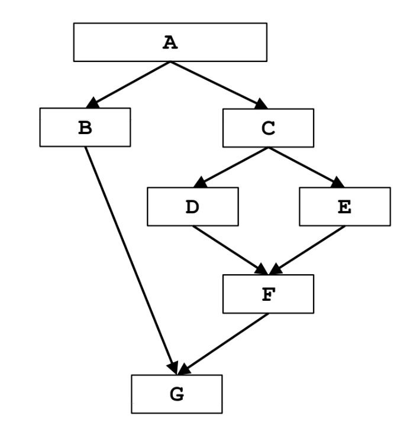

| &nbsp;                  | Dominator Analysis                                                                                      |
| ----------------------- | ------------------------------------------------------------------------------------------------------- |
| Domain                  | set of basic blocks                                                                                     |
| Direction               | Forward: $\text{in}[b] = \land \text{ out}[\text{pred}(b)]$ $\text{out}[b] = f_b(\text{in}[b])$ |
| Transfer function       | $f_b(x) = \left\lbrace b\right\rbrace \cup \text{in}[b]$                                                           |
| Meet operator           | $\cap$                                                                                                  |
| Boundary condition      | $\text{out}[\text{entry}] = \text{entry}                                                                |
| Initial interior points | $\text{out}[b] = $\mathcal{U}$                                                                          |

# Esercizio

# Iterazione 1

| &nbsp; | Genb | Killb | in[b] | out[b] |
| ------ | --------------- | ---------------- | ----- | ------ |
| A | $\left\lbrace A\rigth\rbrace$ | $\emptyset$ | $\emptyset$ | $\left\lbrace A\rigth\rbrace |
| B | $\left\lbrace B\rigth\rbrace$ | $\emptyset$ | $\text{out}[\text{A}]$ | $\left\lbrace A, B\rigth\rbrace$ |
| C | $\left\lbrace C\rigth\rbrace$ | $\emptyset$ | $\text{out}[\text{B}]$ | $\left\lbrace A, C\rigth\rbrace$ |
| D | $\left\lbrace D\rigth\rbrace$ | $\emptyset$ | $\text{out}[\text{C}]$ | $\left\lbrace A, C, D\rigth\rbrace$ |
| E | $\left\lbrace E\rigth\rbrace$ | $\emptyset$ | $\text{out}[\text{E}]$ | $\left\lbrace A, C, E\rigth\rbrace$ |
| F | $\left\lbrace F\rigth\rbrace$ | $\emptyset$ | $\text{out}[\text{F}]$ | $\left\lbrace A, C, F\rigth\rbrace$ |
| G | $\left\lbrace G\rigth\rbrace$ | $\emptyset$ | $\text{out}[\text{G}]$ | $\left\lbrace A, G\rigth\rbrace$ |

Gli out sono cambiati, occorre una nuova iterazione.

# Iterazione 2

| &nbsp; | Genb | Killb | in[b] | out[b] |
| ------ | --------------- | ---------------- | ----- | ------ |
| A | $\left\lbrace A\rigth\rbrace$ | $\emptyset$ | $\emptyset$ | $\left\lbrace A\rigth\rbrace |
| B | $\left\lbrace B\rigth\rbrace$ | $\emptyset$ | $\text{out}[\text{A}]$ | $\left\lbrace A, B\rigth\rbrace$ |
| C | $\left\lbrace C\rigth\rbrace$ | $\emptyset$ | $\text{out}[\text{B}]$ | $\left\lbrace A, C\rigth\rbrace$ |
| D | $\left\lbrace D\rigth\rbrace$ | $\emptyset$ | $\text{out}[\text{C}]$ | $\left\lbrace A, C, D\rigth\rbrace$ |
| E | $\left\lbrace E\rigth\rbrace$ | $\emptyset$ | $\text{out}[\text{E}]$ | $\left\lbrace A, C, E\rigth\rbrace$ |
| F | $\left\lbrace F\rigth\rbrace$ | $\emptyset$ | $\text{out}[\text{F}]$ | $\left\lbrace A, C, F\rigth\rbrace$ |
| G | $\left\lbrace G\rigth\rbrace$ | $\emptyset$ | $\text{out}[\text{G}]$ | $\left\lbrace A, G\rigth\rbrace$ |

Gli out non sono camibati: l'algoritmo termina.
