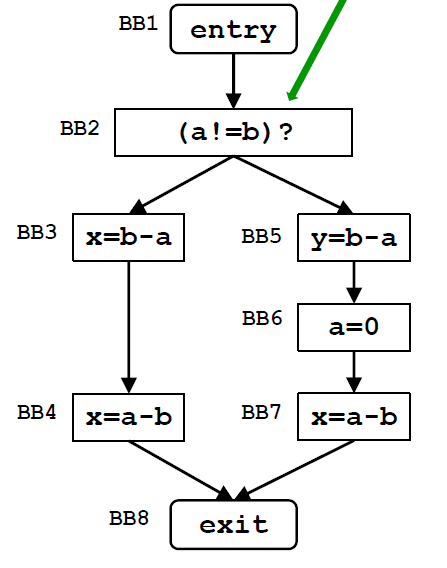

| &nbsp;                  | Very Busy Expressions                                                                                    |
| ----------------------- | -------------------------------------------------------------------------------------------------------- |
| Domain                  | set of expressions                                                                                       |
| Direction               | Backward: $\text{in}[b] = f_b(\text{out}[b])$ $\text{out}[b] = \land \text{ in}[\text{succ}(b)]$ |
| Transfer function       | $f_b(x) = \text{Gen}_b \cup \left(\text{out}[b] - \text{Kill}_b\right)$                                  |
| Meet operator ($\land$) | $\cap$                                                                                                   |
| Boundary condition      | $\text{in}[\text{exit}] = \emptyset$                                                                     |
| Initial interior points | $\text{in}[b] = \mathcal{U}$                                                                             |

# Esercizio

## Iterazione 1:

| &nbsp; | Genb | Killb | in[b] | out[b] |
| ------ | --------------- | ---------------- | ----- | ------ |
| BB1 (entry) | $\emptyset$  | $\emptyset$  | {(a!=b), (b-a)} | in[BB2]|
| BB2 | {(a!=b)} | $\emptyset$  | {(a!=b), (b-a)} | in[BB3] $\cap$ in[BB5] = {(b-a)} |
| BB3 | {(b-a)} | $\emptyset$ | {(b-a), (a-b)} | in[BB4] |
| BB4 | {(a-b)} | $\emptyset$ | {(a-b)} | in[BB8] |
| BB5 | ({b-a}) | $\emptyset$ | {(b-a)} | in[BB6] |
| BB6 | $\emptyset$ | {(a-b)} | $\emptyset$ | in[BB7] |
| BB7 | {(a-b)} | $\emptyset$ | {(a-b)} | in[exit] |
| BB8 (exit) | $\emptyset$ | $\emptyset$ | $\emptyset$ | $\emptyset$ |

Visto che gli out sono cambiati facciamo un'altra iterazione.

## Iterazione 2:

| &nbsp; | Genb | Killb | in[b] | out[b] |
| ------ | --------------- | ---------------- | ----- | ------ |
| BB1 (entry) | $\emptyset$  | $\emptyset$  | {(a!=b), (b-a)} | in[BB2]|
| BB2 | {(a!=b)} | $\emptyset$  | {(a!=b), (b-a)} | in[BB3] $\cap$ in[BB5] = {(b-a)} |
| BB3 | {(b-a)} | $\emptyset$ | {(b-a), (a-b)} | in[BB4] |
| BB4 | {(a-b)} | $\emptyset$ | {(a-b)} | in[BB8] |
| BB5 | ({b-a}) | $\emptyset$ | {(b-a)} | in[BB6] |
| BB6 | $\emptyset$ | {(a-b)} | $\emptyset$ | in[BB7] |
| BB7 | {(a-b)} | $\emptyset$ | {(a-b)} | in[exit] |
| BB8 (exit) | $\emptyset$ | $\emptyset$ | $\emptyset$ | $\emptyset$ |

Nessun out e' cambiato quindi non facciamo ulteriori iterazioni.