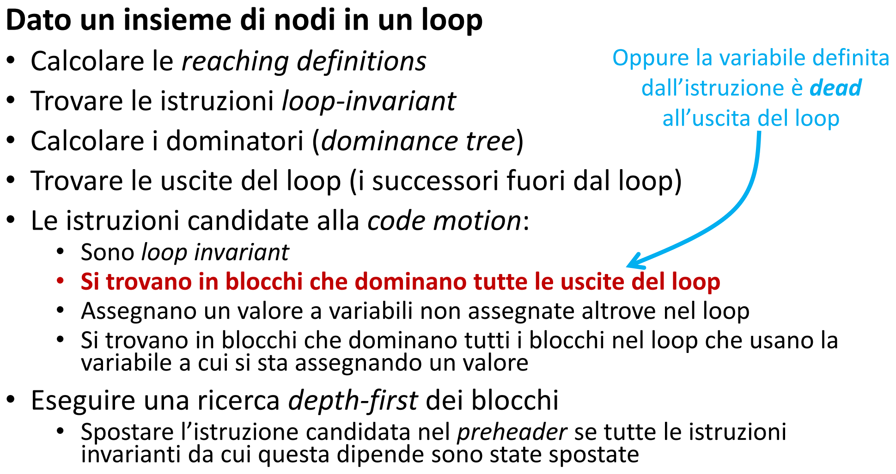
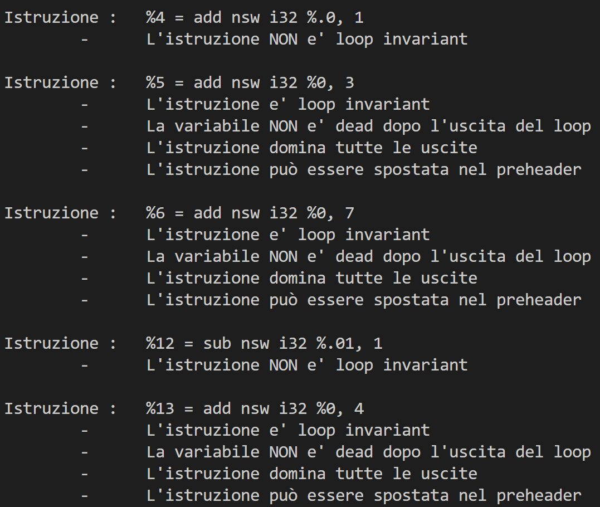
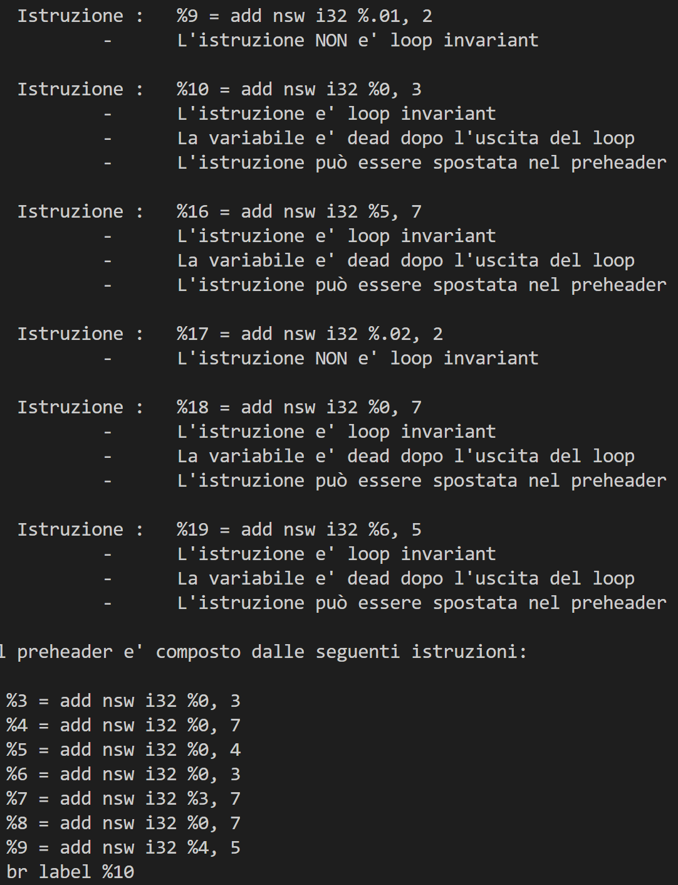

# Laboratorio 3

<aside>
📝 Gruppo: Gabriele Cusato, matricola 152669, e Alessandro Giacconi, matricola 152533.

</aside>

---

# Consegna dell'assignment 3

## Passo per la loop invariant code motion

<br>
Notare che il calcolo delle reaching definitions, il calcolo dei dominatori e il ritrovamento delle uscite del loop sono passaggi spiegati adeguatamente nei commenti del codice di Assignment.cpp. <br><br>
Inoltre gli ultimi 2 punti per trovare le istruzioni candidate alla code motion sono punti che sono automaticamente verificati dalla struttura dei registri SSA utilizzati, infatti è impossibile assegnare un valore ad una variabile assegnata altrove nel loop, in quanto ogni registro viene usato una volta sola ; in più, il fatto di dominare tutti i blocchi che fanno uso della variabile definita è automatico perchè altrimenti la variabile verrebbe usata ma non definita e per questo il compilatore genererebbe un errore prima di arrivare a questo passo. <br><br>
Infine anche l'ultimo punto è automaticamente verificato, in quanto le istruzioni vengono spostate con un ordine dall'alto verso il basso e quindi se un'istruzione dev'essere spostata allora anche le precedenti saranno state già spostate<br><br>



---
# codice di test

di seguito è mostrato il codice del file non ottimizzato 'test.ll' 
```
; #include <stdio.h>

; void foo(int c, int z) {
;   int a = 9, h, m = 0, n = 0, q, r = 0, y = 0;

; LOOP:
;   z = z + 1;
;   y = c + 3;
;   q = c + 7;
;   if (z < 5) {
;     a = a + 2;
;     h = c + 3;
;   } else {
;     a = a - 1;
;     h = c + 4;
;     if (z >= 10) {
;       goto EXIT;
;     }
;   }
;   m = y + 7;
;   n = h + 2;
;   y = c + 7;
;   r = q + 5;
;   goto LOOP;
; EXIT:
;   printf("%d,%d,%d,%d,%d,%d,%d,%d\n", a, h, m, n, q, r, y, z);
; }

; int main() {
;   foo(0, 4);
;   foo(0, 12);
;   return 0;
; }
@.str = private constant [25 x i8] c"%d,%d,%d,%d,%d,%d,%d,%d\0A\00", align 1

define void @foo(i32 %0, i32 %1) {
  br label %3

3:                                                ; preds = %15, %2
  %.05 = phi i32 [ 0, %2 ], [ %19, %15 ]
  %.04 = phi i32 [ 0, %2 ], [ %17, %15 ]
  %.03 = phi i32 [ 0, %2 ], [ %16, %15 ]
  %.01 = phi i32 [ 9, %2 ], [ %.1, %15 ]
  %.0 = phi i32 [ %1, %2 ], [ %4, %15 ]
  %4 = add nsw i32 %.0, 1
  %5 = add nsw i32 %0, 3
  %6 = add nsw i32 %0, 7
  %7 = icmp slt i32 %4, 5
  br i1 %7, label %8, label %11

8:                                                ; preds = %3
  %9 = add nsw i32 %.01, 2
  %10 = add nsw i32 %0, 3
  br label %15

11:                                               ; preds = %3
  %12 = sub nsw i32 %.01, 1
  %13 = add nsw i32 %0, 4
  %14 = icmp sge i32 %4, 10
  br i1 %14, label %20, label %15

15:                                               ; preds = %11, %8
  %.02 = phi i32 [ %10, %8 ], [ %13, %11 ]
  %.1 = phi i32 [ %9, %8 ], [ %12, %11 ]
  %16 = add nsw i32 %5, 7
  %17 = add nsw i32 %.02, 2
  %18 = add nsw i32 %0, 7
  %19 = add nsw i32 %6, 5
  br label %3

20:                                               ; preds = %11
  %21 = call i32 (i8*, ...) @printf(i8* getelementptr inbounds ([25 x i8], [25 x i8]* @.str, i64 0, i64 0), i32 %12, i32 %13, i32 %.03, i32 %.04, i32 %6, i32 %.05, i32 %5, i32 %4)
  ret void
}

declare i32 @printf(i8*, ...)

define i32 @main() {
  call void @foo(i32 0, i32 4)
  call void @foo(i32 0, i32 12)
  ret i32 0
}
```
---
# spiegazione istruzioni

Per le motivazioni date in precedenza saranno controllate solo le proprietà di un istruzione di essere loop invariant, il fatto che il blocco dell'istruzioni domini tutte le uscite e se l'istruzione è dead dopo l'uscita del loop. Inoltre sono state analizzate solamente le istruzioni binarie, ovvero che hanno solo 2 operatori nel right-hand side:

* z = z + 1 -> %4 = add nsw i32 %.0, 1
  * L'istruzione NON è loop invariant perchè fa uso della variabile 'z' definita all'interno del loop <br><br>

* y = c + 3 -> %5 = add nsw i32 %0, 3
  * L'istruzione è loop invariant perchè fa uso della variabile 'c' che è stata passata come parametro alla funzione 'foo' e viene quindi considerata costante
  * La variabile 'y' non è dead dopo l'uscita del loop in quanto viene usata nell'istruzione printf, si controlla quindi la dominanza su tutte le uscite
  * Il blocco in cui si trova la variabile 'y' domina tutte le uscite perchè per arrivare all'uscita si passa necessariamente da questo blocco
  * L'istruzione può quindi essere spostata nel preheader<br><br>

* q = c + 7 -> %6 = add nsw i32 %0, 7
  * l'istruzione è loop invariant per lo stesso principio dell'istruzione precedente
  * la variabile 'q' non è dead dopo l'uscita del loop perchè viene usata nell'istruzione printf, si controlla quindi la dominanza su tutte le uscite
  * Il blocco in cui si trova la variabile 'q' domina tutte le uscite perchè per arrivare all'uscita si passa necessariamente da questo blocco
  * L'istruzione può quindi essere spostata nel preheader<br><br>

* a = a + 2 -> %9 = add nsw i32 %.01, 2
  * L'istruzione NON è loop invariant perchè fa uso della variabile 'a' definita all'interno del loop <br><br>

* h = c + 3 -> %10 = add nsw i32 %0, 3
  * L'istruzione è loop invariant perchè fa uso della variabile 'c' che è stata passata come parametro alla funzione 'foo' e viene quindi considerata costante
  * L'istruzione è dead perchè nella printf è stato usato l'altro registro della variabile h definita nell'altro ramo dell'if, ovvero %13
  * L'istruzione può quindi essere spostata nel preheader<br><br>

* a = a - 1 -> %12 = sub nsw i32 %.01, 1
  * L'istruzione NON è loop invariant perchè fa uso della variabile 'a' definita all'interno del loop <br><br>

* h = c + 4; -> %13 = add nsw i32 %0, 4
  * L'istruzione è loop invariant perchè usa la variabile 'c' come in precedenza
  * La variabile 'h' non è dead dopo l'uscita del loop perchè viene usata nell'istruzione printf, si controlla quindi la dominanza su tutte le uscite
  * Il blocco in cui si trova la variabile 'h' domina tutte le uscite perchè per arrivare all'uscita si passa necessariamente da questo blocco
  * L'istruzione può quindi essere spostata nel preheader<br><br>

* m = y + 7 -> %16 = add nsw i32 %5, 7
  * L'istruzione è loop invariant perchè fa uso della variabile 'y' che è a sua volta loop invariant
  * La variabile è dead dopo l'uscita del loop perchè nella printf viene utilizzato il registro %.03 e non il %16 che corrisponde alla variabile 'm'
  * L'istruzione può quindi essere spostata nel preheader<br><br>
  
* n = h + 2 -> %17 = add nsw i32 %.02, 2
  * L'istruzione NON è loop invariant perchè fa uso della variabile 'h' definita all'interno del loop <br><br>

* y = c + 7 -> %18 = add nsw i32 %0, 7
  * L'istruzione è loop invariant fa uso della variabile 'c' che è stata passata come parametro alla funzione 'foo' e viene quindi considerata costante
  * La variabile è dead dopo l'uscita del loop perchè nonostante la variabile 'y' appaia nell'istruzione printf, essendo la variabile 'y' definita 2 volte, vengono usati 2 registri SSA, quello usato per la precedente definizione della variabile era considerato NON dead, mentre questo si, infatti nella printf appare il registro %5
  * L'istruzione può quindi essere spostata nel preheader<br><br>
  
* r = q + 5 -> %19 = add nsw i32 %6, 5
  * L'istruzione è loop invariant perchè fa uso della variabile 'q' che è a sua volta loop invariant
  * La variabile è dead dopo l'uscita del loop perchè nella printf viene utilizzato il registro %.05 e non il %19 che corrisponde alla variabile 'r'
  * L'istruzione può quindi essere spostata nel preheader<br><br>

---
# Risultato dell'esecuzione

Nell' immagine più avanti è mostrato l'output del comando:
```bash
opt -enable-new-pm=0 -load ./assignment.so -loop-walk test/Loop.ll -disable-output
```
Il comando precedente non genera alcun file. Alla fine di questo documento è comunque presente il comando usato per andare a creare il nuovo file newLoop.ll col codice ottimizzato. Ecco quindi l'output del comando precedente:<br><br>




Comando per generare il codice ottimizzato nel file newLoop.ll:
```bash
opt -enable-new-pm=0 -load ./assignment.so -loop-walk test/Loop.ll -S -o test/newLoop.ll
```