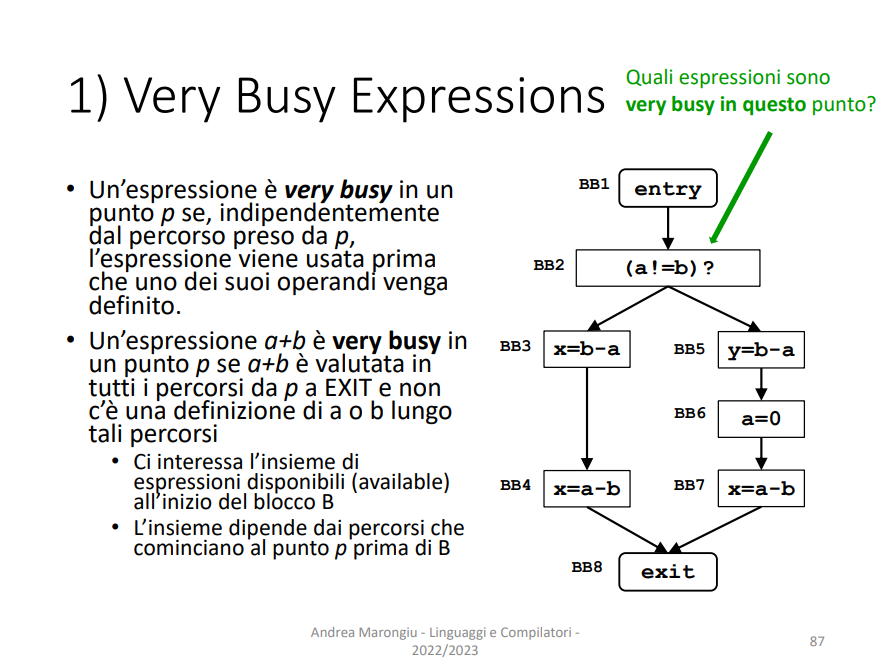

# Dataflow Analysis Assignment

<aside>
📝 Gruppo: Gabriele Cusato, matricola 152669, e Alessandro Giacconi, matricola 152533.

</aside>

---

# 1) Very Busy Expressions

| Domain | Espressioni |
| --- | --- |
| Direction | Backward
IN[b] = Fb( OUT[b] )
OUT[b] = ^IN[ SUCC[b] ]  |
| Transfer Function | Fb(X)= USEb U (X - DEFb) |
| Meet Operation (^) | ∩ |
| Boundary Condition | IN[ exit ] = ø |
| Initial interior points | IN[b] = U |

| /////////// | START | ITER | 1 | ITER | 2 |
| --- | --- | --- | --- | --- | --- |
| /////////// | IN[ b ] | OUT[b] | IN[b] | OUT[b] | IN[b] |
| BB1 | 11 | 01 | 01 | 01 | 01 |
| BB2 | 11 | (11∩01) = 01 | 01 | 01 | 01 |
| BB3 | 11 | 10 | 11 | 10 | 11 |
| BB4 | 11 | 00 | 10 | 00 | 10 |
| BB5 | 11 | 00 | 01 | 00 | 01 |
| BB6 | 11 | 10 | 00 | 10 | 00 |
| BB7 | 11 | 00 | 10 | 00 | 10 |
| BB8 | 00 | 00 | 00 | 00 | 00 |

### Spiegazione

Dopo la lettura dell’esercizio abbiamo capito che il nostro dominio di lavoro è quello delle espressioni, più precisamente ci interessano le espressioni  **a-b** e **b-a**. Per la rappresentazione della proprietà di very busy abbiamo optato per un bit vector, nel quale ogni bit rappresentava una espressione. Avendo così un bit vector composto da 2 bit.

Abbiamo capito che per capire quali espressioni sono very busy in un determinato nodo (o punto) bisogna analizzare i nodi successivi, quindi “guardare il futuro”, perciò è stata utilizzata una backward.

Riguardo al meet operator è stato utilizzando l’intersezione per poter utilizzare la proprietà di very busy solo se entrambi i successori la possiedono. Da qui derivano la boundary condition e la initial interior point, considerando anche la direzione dell’analisi.

Nella transfer function sono stati utilizzati i termini **USEb** e **DEFb** che significano:

- USEb → Effettivo utilizzo dell’espressione, ovverò il bit verrà posto a uno se si presenterà una espressione del tipo x = ESP.
- DEFb → Definizione di una variabile presente nell’espressione, quindi il bit verrà messo a uno se nel blocco si presenterà un assegnazione del tipo a = VAL. (Mentre **a** appartiene ad almeno una espressione)

---

# 2) Dominator Analysis

| Domain | Blocco |
| --- | --- |
| Direction | Forward
OUT[b] = Fb( IN[b] )
IN[b] = ^OUT[ PRED[b] ]  |
| Transfer Function | Fb(X)= HIMb U X |
| Meet Operation (^) | ∩ |
| Boundary Condition | OUT[ entry ] = ø |
| Initial interior points | OUT[b] = U |

| /////////// | START | ITER | 1 | ITER | 2 |
| --- | --- | --- | --- | --- | --- |
| /////////// | OUT[b] | IN[b] | OUT[b] | IN[b] | OUT[b] |
| A | 0000000 | 0000000 | 1000000 | 0000000 | 1000000 |
| B | 1111111 | 1000000 | 1100000 | 1000000 | 1100000 |
| C | 1111111 | 1000000 | 1010000 | 1000000 | 1010000 |
| D | 1111111 | 1010000 | 1011000 | 1010000 | 1011000 |
| E | 1111111 | 1010000 | 1010100 | 1010000 | 1010100 |
| F | 1111111 | 1010000 | 1010010 | 1010000 | 1010010 |
| G | 1111111 | 1000000 | 1000001 | 1000000 | 1000001 |

### Spiegazione

A seguito della lettura della consegna abbiamo intuito che il dominio del problema fosse quello dei singoli blocchi, in questo caso sono i blocchi **A,B,C,D,E,F e G**. Per la rappresentazione della proprietà di dominio abbiamo optato per un bit vector dove ogni bit rappresenta se un blocco domina la posizione attuale. 1 bit per ogni blocco, quindi 7 bit.

Dovendo analizzare ciò che precede il blocco esaminato, quindi il “passato”, abbiamo deciso di utilizzare una analisi di tipo forward.

Anche qui torna utile l’utilizzo dell’intersezione come meet operator, derivando la boundary condition e la initial interior point, continuando a considerare anche la direzione dell’analisi.

Riguardo alla transfer function è stata utilizzata la notazione **HIMb**, ovvero se si passa per quel determinato blocco per raggiungere il punto attuale. Per esempio il primo bit viene messo a 1 quando passiamo sul blocco **A**.

---

# 3) Dominator Analysis

| Domain | Variabili, valori |
| --- | --- |
| Direction | Forward
OUT[b] = Fb( IN[b] )
IN[b] = ^OUT[ PRED[b] ]  |
| Transfer Function | Fb(X)=DEFb U ( X - OLDb ) |
| Meet Operation (^) | ∩ |
| Boundary Condition | OUT[ entry ] = ø |
| Initial interior points | OUT[b] = U |

| ////////// | START | ITER | 1 | ITER | 2 | ITER | 3 |
| --- | --- | --- | --- | --- | --- | --- | --- |
| ////////// | OUT[b] | IN[b] | OUT[b] | IN[b] | OUT[b] | IN[b] | OUT[b] |
| BB1 | ø | ø | ø | ø | ø | ø | ø |
| BB2 | U | ø | <k, 2> | ø | <k, 2> | ø | <k, 2> |
| BB3 | U | <k, 2> | <k, 2> | <k, 2> | <k, 2> | <k, 2> | <k, 2> |
| BB4 | U | <k, 2> | <k, 2>, <a, 4> | <k, 2> | <k, 2>, <a, 4> | <k, 2> | <k, 2>, <a, 4> |
| BB5 | U | <k, 2>, <a, 4> | <k, 2>, <a, 4>, <x, 5> | <k, 2>, <a, 4> | <k, 2>, <a, 4>, <x, 5> | <k, 2>, <a, 4> | <k, 2>, <a, 4>, <x, 5> |
| BB6 | U | <k, 2> | <k, 2>, <a, 4> | <k, 2> | <k, 2>, <a, 4> | <k, 2> | <k, 2>, <a, 4> |
| BB7 | U | <k, 2>, <a, 4> | <k, 2>, <a, 4>, <x, 8> | <k, 2>, <a, 4> | <k, 2>, <a, 4>, <x, 8> | <k, 2>, <a, 4> | <k, 2>, <a, 4>, <x, 8> |
| BB8 | U | <k, 2>, <a, 4> | <k, 4>, <a, 4> | <k, 2>, <a, 4> | <k, 4>, <a, 4> | <k, 2>, <a, 4> | <k, 4>, <a, 4> |
| BB9 | U | <k, 4>, <a, 4> | <k, 4>, <a, 4> | <a, 4> | <a, 4> | <a, 4> | <a, 4> |
| BB10 | U | <k, 4>, <a, 4> | <k, 4>, <a, 4>, <b, 2> | <a, 4> | <a, 4>, <b, 2> | <a, 4> | <a, 4>, <b, 2> |
| BB11 | U | <k, 4>, <a, 4>, <b, 2> | <k, 4>, <a, 4>, <b, 2>, <x, 8> | <a, 4>, <b, 2> | <a, 4>, <b, 2> | <a, 4>, <b, 2> | <a, 4>, <b, 2> |
| BB12 | U | <k, 4>, <a, 4>, <b, 2>, <x, 8> | <k, 4>, <a, 4>, <b, 2>, <x, 8>, <y, 8> | <a, 4>, <b, 2> | <a, 4>, <b, 2>, <y, 8> | <a, 4>, <b, 2> | <a, 4>, <b, 2>, <y, 8> |
| BB13 | U | <k, 4>, <a, 4>, <b, 2>, <x, 8>, <y, 8> | <k, 5>, <a, 4>, <b, 2>, <x, 8>, <y, 8> | <a, 4>, <b, 2>, <y, 8> | <a, 4>, <b, 2>, <y, 8> | <a, 4>, <b, 2>, <y, 8> | <a, 4>, <b, 2>, <y, 8> |
| BB14 | U | <k, 4>, <a, 4> | <k, 4>, <a, 4> | <a, 4> | <a, 4> | <a, 4> | <a, 4> |
| BB15 | U | <k, 4>, <a, 4> | <k, 4>, <a, 4> | <a, 4> | <a, 4> | <a, 4> | <a, 4> |

### Spiegazione

Al termine dello studio del problema abbiamo compreso che il dominio del problema fosse quello della coppia <variabile, valore>, per esempio <k, 2>. Per la rappresentazione della proprietà di costante abbiamo scelto una lista.

Dovendo analizzare ciò che precede il blocco, ovvero il “passato”, si ha utilizzato una analisi di tipo forward.

Per il meet operator bisogna utilizzare un’intersezione, derivando la boundary condition e la initial interior point, continuando a considerare anche la direzione dell’analisi.

Per la transfer function la notazione utilizzata è **DEFb** e **OLDb** che identificano:

- DEFb → definizione di una variabile con il proprio valore assegnato, precisiamo che durante l’iterazione 2 nel BB11 non viene definito nessuna coppia perchè X dipenderebbe da una variabile non costante, ovvero K.
- OLDb → vecchia definizione della variabile definita precedentemente, quindi si andrà ad eliminare il vecchio elemento presente nella lista, in questo modo nell’output si avrà solo il valore corretto.