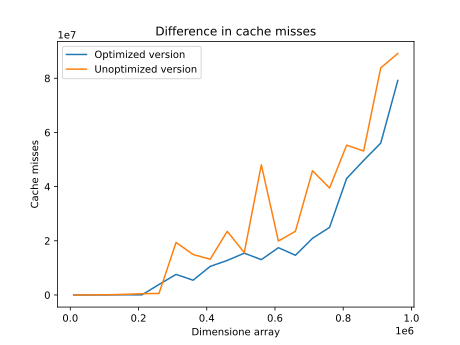
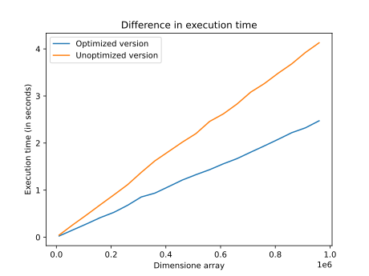

# Loop fusion

La **loop fusion** è un'ottimizzazione che ha lo scopo di migliorare l'utilizzo della cache da parte del programma.

Si prenda come esempio la seguente funzione:

``` c
#define ARRAY_SIZE 100

void populate(int a[ARRAY_SIZE], int b[ARRAY_SIZE], int c[ARRAY_SIZE])
{
    for (int i = 0; i < ARRAY_SIZE; i++)
    {
        a[i] = i;
        b[i] = a[i] * 2;
    }

    for (int i = 0; i < ARRAY_SIZE; i++)
    {
        c[i] = b[i];
    }
}
```

I due loop iterano lo stesso numero di volte (`ARRAY_SIZE`), ovvero hanno lo stesso **trip count**.

In entrambi i loop si accede allo stesso valore `b[i]`, una volta in scrittura ed una volta in scrittura.

Scritti in questo modo, i loop non sfruttano per niente la cache. Il valore `b[i]` scritto nel 1° loop sarebbe già in cache per poter eseguire l'istruzione `c[i] = b[i] + 1` in maniera efficiente. Essendo però le due istruzioni in loop diversi, la cache non viene utilizzata.

Una versione più efficiente si avrebbe **fondendo** dei due loop:
``` c
#define ARRAY_SIZE 100

void populate(int a[ARRAY_SIZE], int b[ARRAY_SIZE], int c[ARRAY_SIZE])
{
    for (int i = 0; i < ARRAY_SIZE; i++)
    {
        a[i] = i;
        b[i] = a[i] * 2;
        c[i] = b[i];
    }
}
```

## Condizioni per poter applicare la loop fusion

Tutte le seguenti condizioni devono essere rispettate:

- i due loop sono **adiacenti**;
- i due loop devono iterare lo <u>stesso numero di volte</u>;
- i due loop devono essere **control flow equivalent** (quando $L_i$ esegue esegue anche $L_j$ e quando esegue $L_j$ esegue anche $L_i$);
- non possono esserci delle **negative distance dependencies** tra i due loop.
  - una negative distance dependency si ha quando un'iterazione $m$ di $L_j$ utilizza un valore calcolato in un'iterazione $m + n$ di $L_i$ (con $n > 0$ e $L_i$ predecessore di $L_j$)

### 1. Controllo sull'adiacenza

Due loop $L_i, L_j$ sono adiacenti se e solo se non ci sono altre istruzioni tra i due loop.

Questo controllo l'abbiamo implementato nella funzione [`LoopFusion::areLoopsAdjacent(llvm::Loop*, llvm::Loop*)`](https://github.com/rickysixx/Linguaggi-e-Compilatori-2022-2023/blob/LoopFusion/LoopFusion/lib/LoopFusion.cpp#LL53C24-L53C24):

``` c++
bool LoopFusion::areLoopsAdjacent(const Loop* i, const Loop* j) const
{
    const BasicBlock* iExitBlock = i->getExitBlock();
    const BasicBlock* jPreheader = j->getLoopPreheader();

    return iExitBlock != nullptr &&
           jPreheader != nullptr &&
           iExitBlock == jPreheader &&
           jPreheader->getInstList().size() == 1;
}
```

Per semplificare il controllo, abbiamo considerato soltanto i loop che hanno una sola uscita. Per questi loop il metodo [`llvm::LoopBase::getExitBlock()`](https://llvm.org/doxygen/classllvm_1_1LoopBase.html#ab48af53a5000ecede46c76dabb4578d2) restituisce qualcosa `!= nullptr`.

Ci sono diversi casi in cui un loop ha più di un'uscita:
- presenza di `break` o `return` nel body del loop;
- invocazione di funzioni di libreria (es. `exit`), per le quali il compilatore non ha modo di sapere se alterano il control flow

Oltre ad essere più complesso, gestire i loop con più di un'uscita sarebbe stato anche inutile ai fini dell'ottimizzazione. In tutti questi casi è molto probabile infatti che il compilatore non sia in grado di calcolare la trip count del loop (es. se la `break`/`return` dipende da un particolare valore presente nell'array su cui sta iterando), perciò la loop fusion non sarebbe comunque fattibile.

### 2. Controllo sul numero di iterazioni

Il numero di iterazioni di un loop (**trip count**) si ottiene tramite la **scalar evolution analysis**. Si tratta di un'analisi che cerca di capire l'evoluzione dei valori scalari (tra cui ad esempio la loop induction variable) durante il flusso d'esecuzione del programma.

Il metodo [`llvm::ScalarEvolution::getSmallConstantTripCount(llvm::Loop*)`](https://llvm.org/doxygen/classllvm_1_1ScalarEvolution.html#abec0c616087c002528fcf80c6583eadd) permette di ottenere il trip count di un loop. Se questo non è calcolabile a compile time, viene restituito `0`.

Due loop iterano lo stesso numero di volte se:
- il trip count di entrambi è calcolabile (i.e. è `!= 0`);
- i due loop hanno lo stesso trip count

Per semplicità, la nostra implementazione si ferma a questi controlli.

``` c++
bool LoopFusion::haveSameTripCount(ScalarEvolution& SE, Loop const* loopi, Loop const* loopj) const
{
    unsigned int tripi = SE.getSmallConstantTripCount(loopi);
    unsigned int tripj = SE.getSmallConstantTripCount(loopj);
    return tripi != 0 && tripj != 0 && tripi == tripj;
}
```

In realtà però ci sarebbero da fare ragionamenti molto più complessi oltre al numero di iterazioni. Si prenda questo esempio:

``` c
#define SIZE 10

void fun(int a[SIZE], int b[SIZE])
{
    for (int i = 0; i < SIZE; i++)
    {
        a[i] = b[i];
    }

    for (int i = SIZE - 1; i >= 0; i--)
    {
        b[i] = i;
    }
}
```

I due loop iterano lo stesso numero di volte, ma lo **spazio delle iterazioni** è percorso in ordine inverso fra i due loop. La loop fusion in questo caso sarebbe più complessa, perché bisognerebbe anche modificare l'induction variable del 1° loop in modo da rispettare la semantica del programma.

### 3. Controllo sulla control flow equivalence

Due loop $L_i, L_j$ sono **control flow equivalent** se:
- quando esegue $L_i$ esegue anche $L_j$;
- quando esegue $L_j$ allora è stato eseguito anche $L_i$

In altre parole, affinché due loop siano control flow equivalent non devono esistere percorsi che permettano di eseguire uno solo fra $L_i$ ed $L_j$.

Questo controllo si effettua tramite l'analisi sul **dominator tree** e sul **post-dominator tree**.

``` c++
bool LoopFusion::areControlFlowEquivalent(DominatorTree& DT, PostDominatorTree& PT, const Loop* loopi, const Loop* loopj) const
{
    return DT.dominates(loopi->getHeader(), loopj->getHeader()) &&
           PT.dominates(loopj->getHeader(), loopi->getHeader());
}
```

### 4. Controllo sulle dipendenze di dato

Poiché il controllo sulle dipendenze è molto complesso, nella nostra implementazione abbiamo dato per scontato che questa condizione sia sempre verificata:

``` c++
bool LoopFusion::checkNegativeDistanceDeps(Loop* loopi, Loop* loopj) const { return true; }
```

# Confronto tra versione ottimizzata e non ottimizzata 





