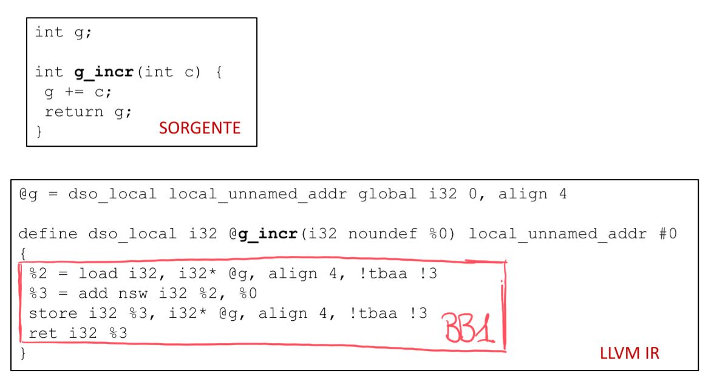
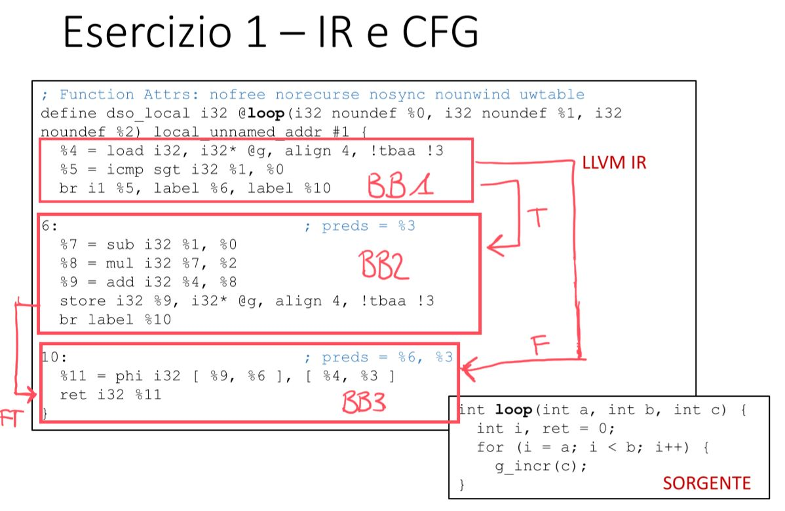

# Laboratorio 1

<aside>
📝 Gruppo: Gabriele Cusato, matricola 152669, e Alessandro Giacconi, matricola 152533.

</aside>

---

# Esercizio 1 – IR e CFG

## Disegnare il CFG per ogni funzione

1a Funzione



2a Funzione



### Cos’è successo al loop?

Il loop è stato eliminato perché sono state apportate delle ottimizzazioni alla IR e questo si può notare dalla label '6' dove avviene una moltiplicazione che serve ad rimuoverlo.

### Provare a rigenerare la IR con l’opzione -O0 al comando di invocazione di clang. Cosa cambia nell’intermedio? Perchè?

Il flag -O0 non effettua ottimizzazioni, si occupa di tradurre alla lettera il codice in IR, mentre il flag -O2 ottimizza rimuovendo il loop.

Per fare un esempio, tramite il flag -O0 i registri vengono prima tutti allocati e poi viene effettuata la store, invece col flag -O2 i registri vengono ottimizzati.

L'opzione -Rpass del comando clang viene utilizzata per generare dei report dettagliati sull'applicazione dei pass di ottimizzazione sul codice sorgente, aggiungendo istruzioni per il debugging.

---

# Esercizio 2 - TestPass

Dopo aver creato la rappresentazione intermedia anche per il modulo di Fibonacci, si è completato il file TestPass.cpp con i controlli e gli output richiesti.

### Estendete il passo TestPass di modo che analizzi la IR e stampi alcune informazioni utili per ciascuna delle funzioni che compaiono nel programma di test:
### 1. Nome
### 2. Numero di argomenti (’N+*’ in caso di funzione variadica)
### 3. Numero di chiamate a funzione nello stesso modulo
### 4. Numero di Basic Blocks
### 5. Numero di Istruzioni

Per far ciò abbiamo utilizzo il comando:

```
opt -load-pass-plugin=./libTestPass.so -passes=test-pass test/<nome-file>.ll -disable-output
```

Inoltre è possibile testare il file TestPass e visualizzare l’analisi dei vari moduli.

Il nome della funzione è stato ottenuto tramite il metodo "getName" della funzione F, ottenuta iterando il modulo passato come parametro al comando "opt" scritto sopra. Per ottenere il valore in stringa stampabile è stato usato il costrutto ".data()". Per stampare il numero di argomenti è stato usato il metodo getFunctionType() e "getNumParams", mentre per identificare le funzioni variadiche si è utilizzato il metodo "getFunctionType". Successivamente è stata usata una serie di cicli for per ciclare le altre funzioni del modulo, insieme ai basic blocks e le singole istruzioni, sia per contare i vari dati richiesti nella consegna, sia per verificare il numero di chiamate della funzione specifica analizzata. Infatti dentro il for più interno sono presenti 2 costrutti 'if' per controllare se l'istruzione analizzata è una chiamata della funzione analizzata. Infine sono stati stampati i valori dei counter definiti in precedenza.

La spiegazione più approfondita del codice del file TestPass è presente sottoforma di commenti.