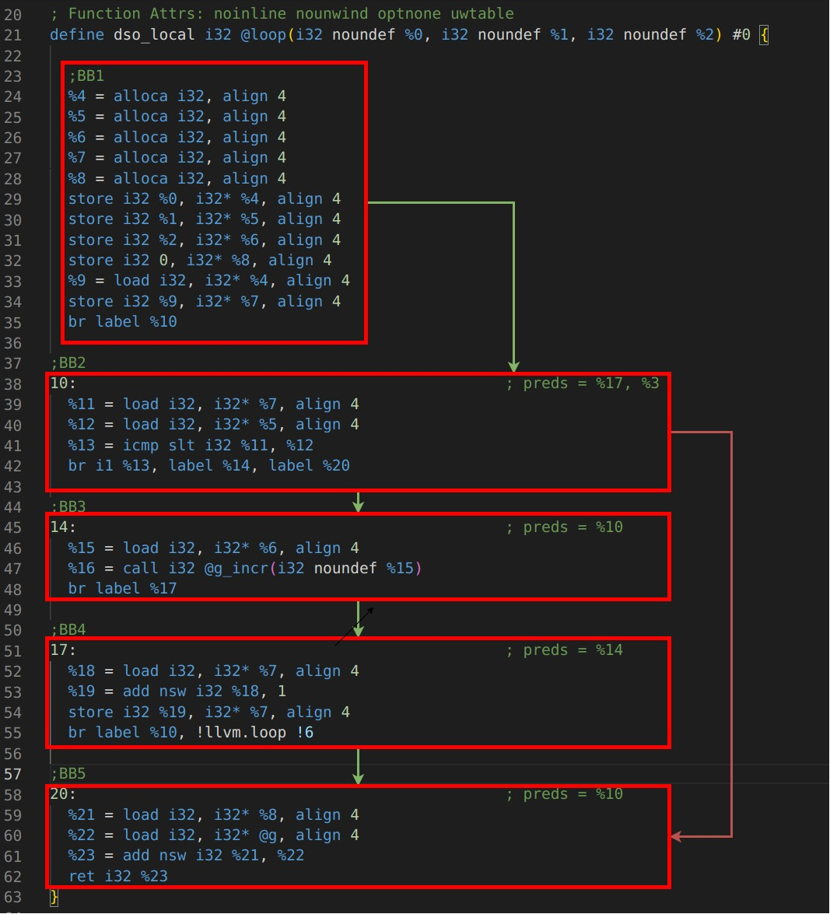

# CFG loop non ottimizzato

# Spiegazione: Loop ottimizzato 

Definizione funzione Loop(a,b,c)

    define dso_local i32 @loop(i32 noundef %0, i32 noundef %1, i32 noundef %2) local_unnamed_addr #1 
    {

# BB1
controllo i valori di a e b
decido __se fare il loop o meno__

- %4 carico la variabile globale g
- %5  b > a ? 1 : 0
- se %5 è 1 vado alla label 6 a calcolare il valore
- se %5 è 0 salto il loop (label 10)

codice:

    %4 = load i32, i32* @g, align 4, !tbaa !5
    %5 = icmp sgt i32 %1, %0
   
    br i1 %5, label %6, label %10

### F --> BB3 
### T --> BB2

# BB2
__ottimizzo il loop__

a --> valore iniziale
b --> valore di fine

n_cicli = b - a
valore di ritorno --> n_cicli * c + g

codice:

    6:                                    ; preds = %3
    
    %7 = sub i32 %1, %0
    %8 = mul i32 %7, %2
    %9 = add i32 %4, %8

    store i32 %9, i32* @g, align 4, !tbaa !5
    br label %10

Passo alla label 10

### FT --> BB3
    
# BB3
- se vengo da __BB1__ ritorno g
- se vengo da __BB2__ ritorno %9 (loop calcolato)

codice:

    10:                                    ; preds = %6, %3

    %11 = phi i32 [ %9, %6 ], [ %4, %3 ]
    ret i32 %11
    }

ritorno %11 al main

### T --> BB2
### F --> return main con il risultato